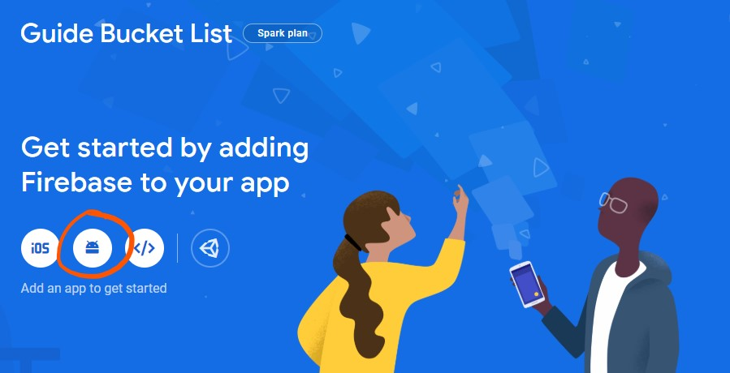
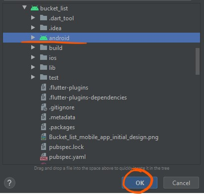
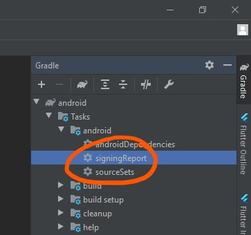
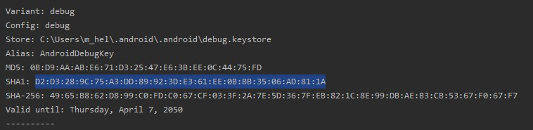
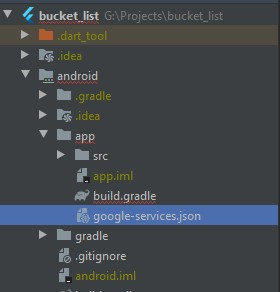
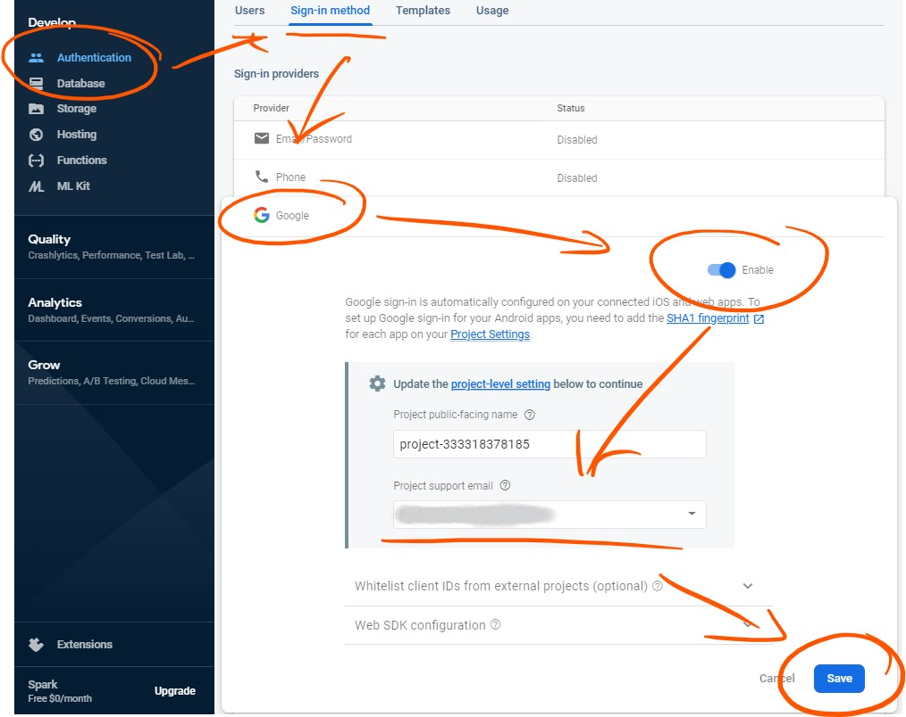

# bucketlist
A School Flutter project

## About this app
This app "Bucket List" helps to set important life goals and follow them up.

### Authors
Designed and coded by: Egert Klaamas, Mihkel Vaher, Marvin Helstein, Maksim Jelizarov, Marko Rillo, Liisa Proode. Done in Mobile Application Development course IFI6224.DT of Tallinn University. Supervisor of the course: Roman Gorislavski.

### Development toolset
1. Android Studio version 3.6.1+
2. Android version 4.1+
3. Flutter version 1.17.0
4. Dart version 2.7.2
5. Testing on emulator and real device: Pixel 2 API 28 and Pixel 2 API 29, Android version: 9.0
6. Figma for design mockups

### Original design

### Views
TODO: add here the views

### Installation
Below are steps on how to get a development environment running.

#### Clone
First clone the project, open it in Android Studio and get all required dependencies.

#### Firebase setup
Since the project is using Firebase Services, we need to set up a project in Firebase.
Follow the steps below to set up a Firebase project and connect the app with it.

Open [Firebase Console](https://console.firebase.google.com/),
log in and create a project.
You may choose any name you like for the project.

Once the project is created, we need to connect the app.
Start by clicking the android button in the Overview page.

Package name is `com.careapps.bucketlist`, nickname is anything you like.

Because the app uses Google Sign-In, we must also set a certificate SHA-1 hash.
To find it, go back to Android Studio and open the android project inside the flutter app

To find the signing certificate hash, execute the signingReport gradle task

In the output, find the debug cert and copy it's SHA-1 hash and paste it to firebase.

The first step in firebase should look something like this

Click **Register app** and download the `google-services.json` file that's given in the next step.

Open the Flutter app in Android Studio again and place `google-services.json` to `bucket_list/android/app/` folder.

Finish the app setup in Firebase, by pressing **Next** a couple of times.

Next we need to enable Google sign-in and Cloud Firestore.
Go to **Authentication** and click `Set up sign-in method`.
Then click on **Google**, enable it, set a support email and save.

Lastly, let's enable Cloud Firestore.

Go to **Database** and click **Create database**.
Select **Start in test mode** and hit **Next**.
Select whichever location you prefer and click **Done**

With that, the Firebase setup is complete and you are ready to run the app.
Make sure your phone is connected to your computer and in Android Studio hit `Shift+F10` to build and run the app.

### Video demonstration
TODO: add here the demonstration

### Documentation
TODO: instructions of use

## Getting Started with Flutter

This project is a starting point for a Flutter application.

A few resources to get you started if this is your first Flutter project:

- [Lab: Write your first Flutter app](https://flutter.dev/docs/get-started/codelab)
- [Cookbook: Useful Flutter samples](https://flutter.dev/docs/cookbook)

For help getting started with Flutter, view our
[online documentation](https://flutter.dev/docs), which offers tutorials,
samples, guidance on mobile development, and a full API reference.
